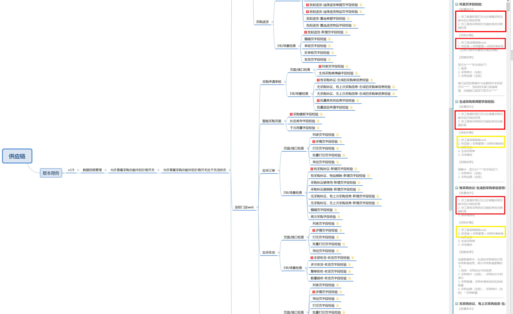
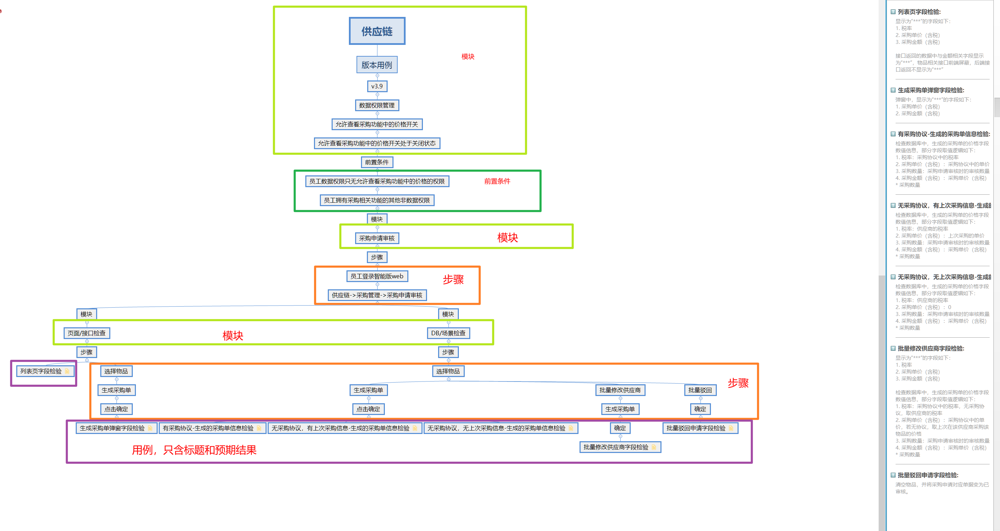

# 用例编写
### 用例编写
- - -
1. 现状
部门使用xmind编写测试用例，按模块目录结构来构建用例，用例的全部信息都在叶子节点中。
2. 分析
一个模块下的大部分用例，其前置条件、用例步骤都有较多的重复内容，实际截图如下：
  
3. 问题
- 编写效率低
- 大量复制粘贴
- 人为错误多
4. 优化（个人）
- 思路
节点表明模块和步骤，叶子节点含标题和预期结果
- 具体截图

- 优点
    - 修改时，用例变动小
    - 重复内容多用例，效率高
- 缺点
    - 模块和步骤穿插，需要一定时间整理和修改
    - 步骤过多的用例导致拉得过长，不直观
    - 理解上和操作上较之前的方法难度变大了