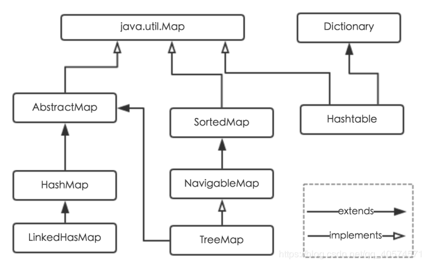
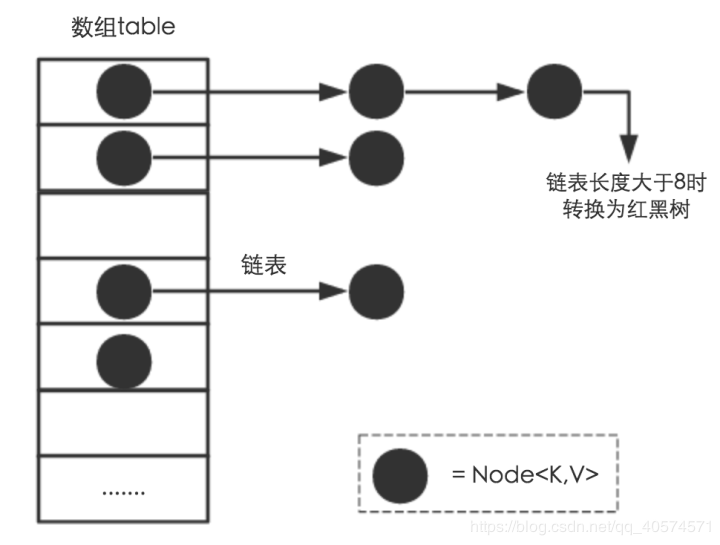
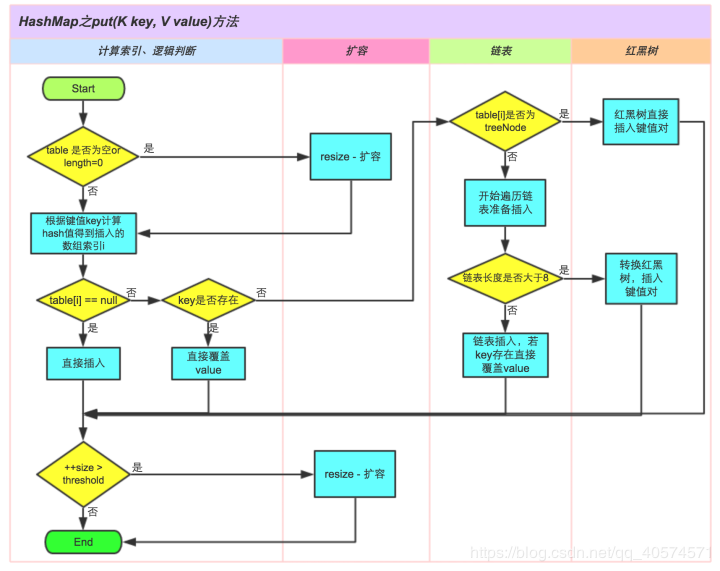
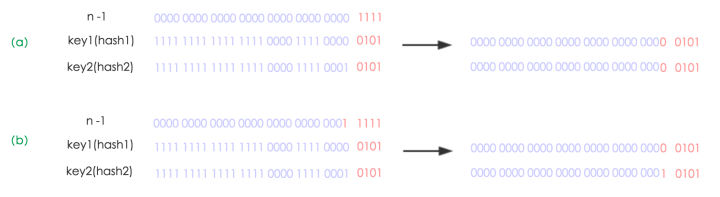

# HashMap原理
### 1. 概念
HashMap是键值映射的数据类型
### 2. 简介
Java中Map类的关系：  
  
- HashMap
hashcode作为键来存储数据，具有很快的访问速度，允许键为null，但只能允许一个。hashmap是线程不安全的，允许多个线程同时写hashmap，会导致数据不一致。线程安全需要用Collections的synchronizedMap方法使HashMap具有线程安全的能力，或者使用ConcurrentHashMap。
- Hashtable
功能与hashmap显示，但是其是线程安全的，继承自Dictionary，并发能力低于ConcurrentHashMap。
- LinkedHashMap
是HashMap的子类，保留了插入时候的顺序。
- TreeMap
实现了SortedMap类，使得hash表能根据键来排序，默认是键的升序，可以传入指定的比较器。
### 3. 存储结构-字段
  
主要用到三种数据结构，数组+链表+红黑树（长度大于8）
- 哈希桶数组
```java
static class Node<K,V> implements Map.Entry<K,V> {
        final int hash;    //用来定位数组索引位置
        final K key;
        V value;
        Node<K,V> next;

        Node(int hash, K key, V value, Node<K,V> next) { ... }
        public final K getKey(){ ... }
        public final V getValue() { ... }
        public final String toString() { ... }
        public final int hashCode() { ... }
        public final V setValue(V newValue) { ... }
        public final boolean equals(Object o) { ... }
}
```
上面的代码片段是HashMap的内部类，实现了Map.Entry接口，一个Node对象就是一个键值对。
- 哈希表存储原理
采用链地址法来解决hash冲突的问题，也就是数组加链表的形式来处理冲突。Hash桶的大小很关键，如果太大浪费空间，且数据较为分散；如果太小，冲突较多，使得hash查找的效率降低。采用一个好的hash算法和扩容机制能有效减少冲突。  
HashMap中较为重要的几个字段如下：
```java
     int threshold;             // 所能容纳的key-value对极限
     final float loadFactor;    // 负载因子
     int modCount;    // 记录内部结构发生变化的次数
     int size;    // 实际键值对个数
```
桶的初始长度length默认为16，负载因子loadFactor的默认值为0.75，threshold的取值逻辑为threshold = length * loadFactor。当size大于threshold时，会进行扩容，扩容之后的容量为扩容之前的两倍，桶的长度一定为2的n次方，取模和扩容做优化。这样设计也可能会导致链表的长度过大，所以为了提高性能，之后引入了红黑树，当链表的长度大于8时，会使用红黑树来实现。
### 功能实现-方法
- 确定键所在哈希桶数组位置的方法
```java
方法一：
static final int hash(Object key) {   //jdk1.8 & jdk1.7
     int h;
     // h = key.hashCode() 为第一步 取hashCode值
     // h ^ (h >>> 16)  为第二步 高位参与运算
     return (key == null) ? 0 : (h = key.hashCode()) ^ (h >>> 16);
}
方法二：
static int indexFor(int h, int length) {  //jdk1.7的源码，jdk1.8没有这个方法，但是实现原理一样的
     return h & (length-1);  //第三步 取模运算
}
```
Hash算法分三步：取key和hashcode的值、高位运算、取模运算。  
前两步是在计算hash，高位和低位做异或操作。最后一步是在计算数组的小标，因为哈希桶的长度为2的n次方，故h & (length-1)本质等于h % length，但用位操作比取模运算的效率高。
- put方法
```java
 public V put(K key, V value) {
      // 对key的hashCode()做hash
      return putVal(hash(key), key, value, false, true);
  }
\  
  final V putVal(int hash, K key, V value, boolean onlyIfAbsent,
                 boolean evict) {
      Node<K,V>[] tab; Node<K,V> p; int n, i;
      // 步骤①：tab为空则创建
     if ((tab = table) == null || (n = tab.length) == 0)
         n = (tab = resize()).length;
     // 步骤②：计算index，并对null做处理 
     if ((p = tab[i = (n - 1) & hash]) == null) 
         tab[i] = newNode(hash, key, value, null);
     else {
         Node<K,V> e; K k;
         // 步骤③：节点key存在，直接覆盖value
         if (p.hash == hash &&
             ((k = p.key) == key || (key != null && key.equals(k))))
             e = p;
         // 步骤④：判断该链为红黑树
         else if (p instanceof TreeNode)
             e = ((TreeNode<K,V>)p).putTreeVal(this, tab, hash, key, value);
         // 步骤⑤：该链为链表
         else {
             for (int binCount = 0; ; ++binCount) {
                 if ((e = p.next) == null) {
                     p.next = newNode(hash, key,value,null);
                        //链表长度大于8转换为红黑树进行处理
                     if (binCount >= TREEIFY_THRESHOLD - 1) // -1 for 1st  
                         treeifyBin(tab, hash);
                     break;
                 }
                    // key已经存在直接覆盖value
                 if (e.hash == hash &&
                     ((k = e.key) == key || (key != null && key.equals(k))))                                       
                     break;
                 p = e;
             }
         }         
         if (e != null) { // existing mapping for key
             V oldValue = e.value;
             if (!onlyIfAbsent || oldValue == null)
                 e.value = value;
             afterNodeAccess(e);
             return oldValue;
         }
     }
\     
     ++modCount;
     // 步骤⑥：超过最大容量 就扩容
     if (++size > threshold)
         resize();
     afterNodeInsertion(evict);
     return null;
 }
```
  
- 扩容机制
```java
\
final Node<K,V>[] resize() {
     Node<K,V>[] oldTab = table;
     int oldCap = (oldTab == null) ? 0 : oldTab.length;
     int oldThr = threshold;
     int newCap, newThr = 0;
     if (oldCap > 0) {
         // 超过最大值就不再扩充了，就只好随你碰撞去吧
         if (oldCap >= MAXIMUM_CAPACITY) {
             threshold = Integer.MAX_VALUE;
             return oldTab;
         }
         // 没超过最大值，就扩充为原来的2倍
         else if ((newCap = oldCap << 1) < MAXIMUM_CAPACITY &&
                  oldCap >= DEFAULT_INITIAL_CAPACITY)
             newThr = oldThr << 1; // double threshold
     }
     else if (oldThr > 0) // initial capacity was placed in threshold
         newCap = oldThr;
     else {               // zero initial threshold signifies using defaults
         newCap = DEFAULT_INITIAL_CAPACITY;
         newThr = (int)(DEFAULT_LOAD_FACTOR * DEFAULT_INITIAL_CAPACITY);
     }
     // 计算新的resize上限
     if (newThr == 0) {

         float ft = (float)newCap * loadFactor;
         newThr = (newCap < MAXIMUM_CAPACITY && ft < (float)MAXIMUM_CAPACITY ?
                   (int)ft : Integer.MAX_VALUE);
     }
     threshold = newThr;
     @SuppressWarnings({"rawtypes"，"unchecked"})
         Node<K,V>[] newTab = (Node<K,V>[])new Node[newCap];
     table = newTab;
     if (oldTab != null) {
         // 把每个bucket都移动到新的buckets中
         for (int j = 0; j < oldCap; ++j) {
             Node<K,V> e;
             if ((e = oldTab[j]) != null) {
                 oldTab[j] = null;
                 if (e.next == null)
                     newTab[e.hash & (newCap - 1)] = e;
                 else if (e instanceof TreeNode)
                     ((TreeNode<K,V>)e).split(this, newTab, j, oldCap);
                 else { // 链表优化重hash的代码块
                     Node<K,V> loHead = null, loTail = null;
                     Node<K,V> hiHead = null, hiTail = null;
                     Node<K,V> next;
                     do {
                         next = e.next;
                         // 原索引
                         if ((e.hash & oldCap) == 0) {
                             if (loTail == null)
                                 loHead = e;
                             else
                                 loTail.next = e;
                             loTail = e;
                         }
                         // 原索引+oldCap
                         else {
                             if (hiTail == null)
                                 hiHead = e;
                             else
                                 hiTail.next = e;
                             hiTail = e;
                         }
                     } while ((e = next) != null);
                     // 原索引放到bucket里
                     if (loTail != null) {
                         loTail.next = null;
                         newTab[j] = loHead;
                     }
                     // 原索引+oldCap放到bucket里
                     if (hiTail != null) {
                         hiTail.next = null;
                         newTab[j + oldCap] = hiHead;
                     }
                 }
             }
         }
     }
     return newTab;
 }
```
扩容大小为原来的2倍，所以要么元素的位置不变，要么移动在移动2次幂的位置，扩容变数组下标的计算例子如下（16变为32）：  
  
实际上重新计算得到的下标，为原位置加上oldCap（16），再仔细一看就会发现当新增加的bit为0，那么保持原位置不变，如果为1，则变成原位置+oldCap