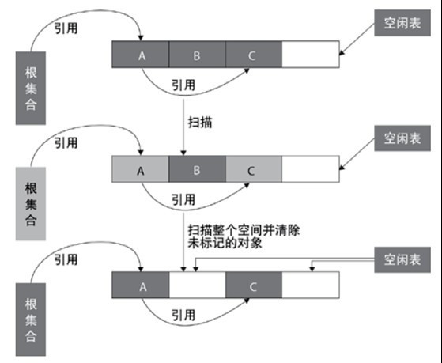
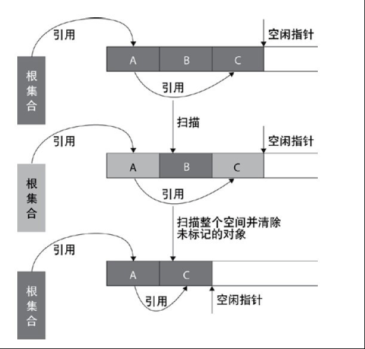
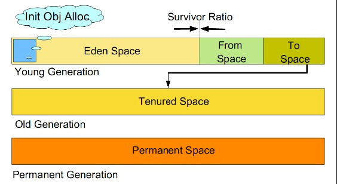
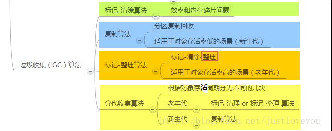

# 垃圾回收算法
### 1. 标记清除算法
  
- 含义：标记-清除算法分为标记和清除两个阶段。该算法首先从根集合进行扫描，对存活的对象对象标记，标记完毕后，再扫描整个空间中未被标记的对象并进行回收。
- 不足：
    - 效率问题：标记和清除两个过程的效率都不高
    - 空间问题：标记-清除算法不需要进行对象的移动，并且仅对不存活的对象进行处理，因此标记清除之后会产生大量不连续的内存碎片，空间碎片太多可能会导致以后在程序运行过程中需要分配较大对象时，无法找到足够的连续内存而不得不提前触发另一次垃圾收集动作。
### 2. 复制算法
  
- 含义：复制算法将可用内存按容量划分为大小相等的两块，每次只使用其中的一块。当这一块的内存用完了，就将还存活着的对象复制到另外一块上面，然后再把已使用过的内存空间一次清理掉。这种算法适用于对象存活率低的场景，比如新生代。这样使得每次都是对整个半区进行内存回收，内存分配时也就不用考虑内存碎片等复杂情况，只要移动堆顶指针，按顺序分配内存即可，实现简单，运行高效。
- 不足：
    - 需要额外50%空间作为担保
    - 对象长期存活方法效率低
### 3. 标记整理算法
  
- 含义：标记整理算法的标记过程类似标记清除算法，但后续步骤不是直接对可回收对象进行清理，而是让所有存活的对象都向一端移动，然后直接清理掉端边界以外的内存，类似于磁盘整理的过程，该垃圾回收算法适用于对象存活率高的场景（老年代）。
- 不足：移动内存需要耗费时间
### 4. 分代收集算法
  
- 含义：不同的对象的生命周期(存活情况)是不一样的，而不同生命周期的对象位于堆中不同的区域，因此对堆内存不同区域采用不同的策略进行回收可以提高 JVM 的执行效率。新生代对象存活率低，就采用复制算法；老年代存活率高，就用标记清除算法或者标记整理算法。Java堆内存一般可以分为新生代、老年代和永久代。
- 新生代：尽可能快速的收集掉那些生命周期短的对象，一般情况下，所有新生成的对象首先都是放在新生代的。
- 老年代：一些生命周期较长的对象，就像上面所叙述的那样，在新生代中经历了N次垃圾回收后仍然存活的对象就会被放到老年代中。
- 永久代：用于存放静态文件，如Java类、方法等。永久代对垃圾回收没有显著影响，但是有些应用可能动态生成或者调用一些class，例如使用反射、动态代理、CGLib等bytecode框架时，在这种时候需要设置一个比较大的永久代空间来存放这些运行过程中新增的类。
### 小结
  