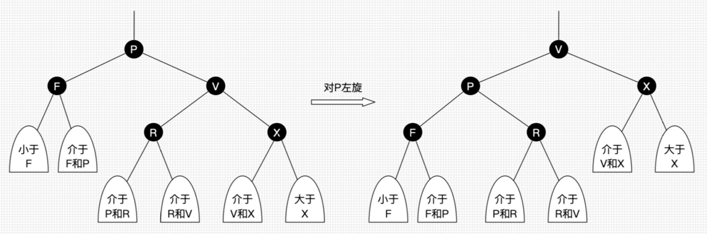
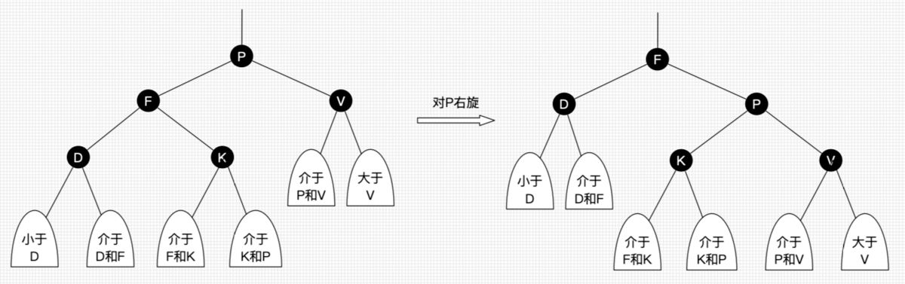
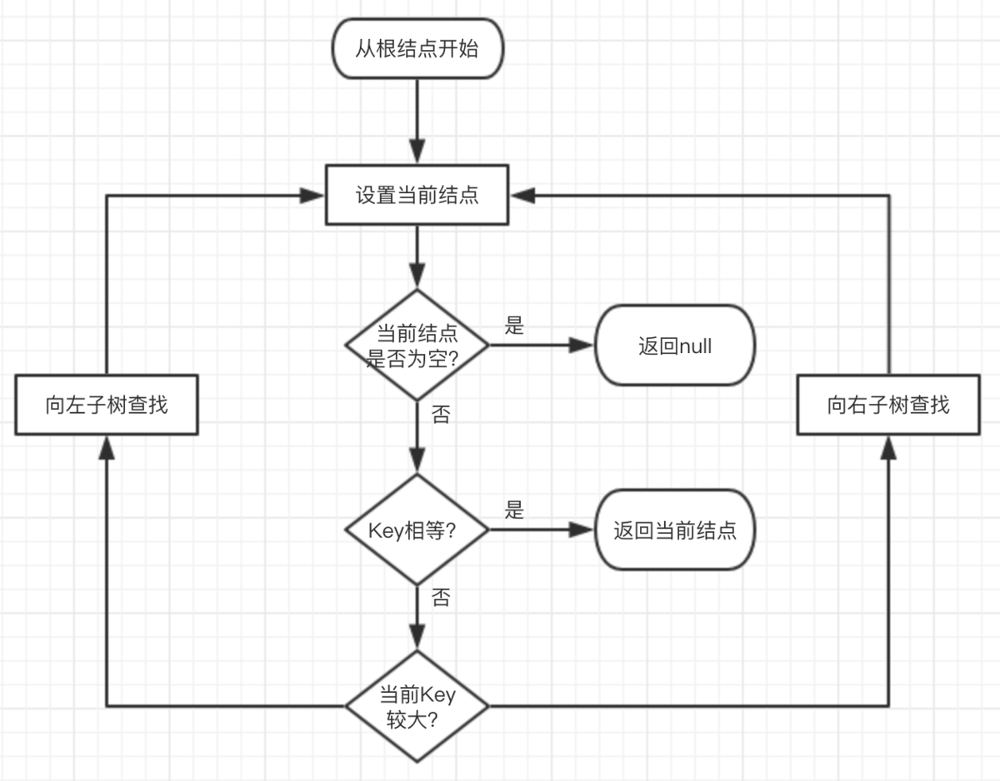
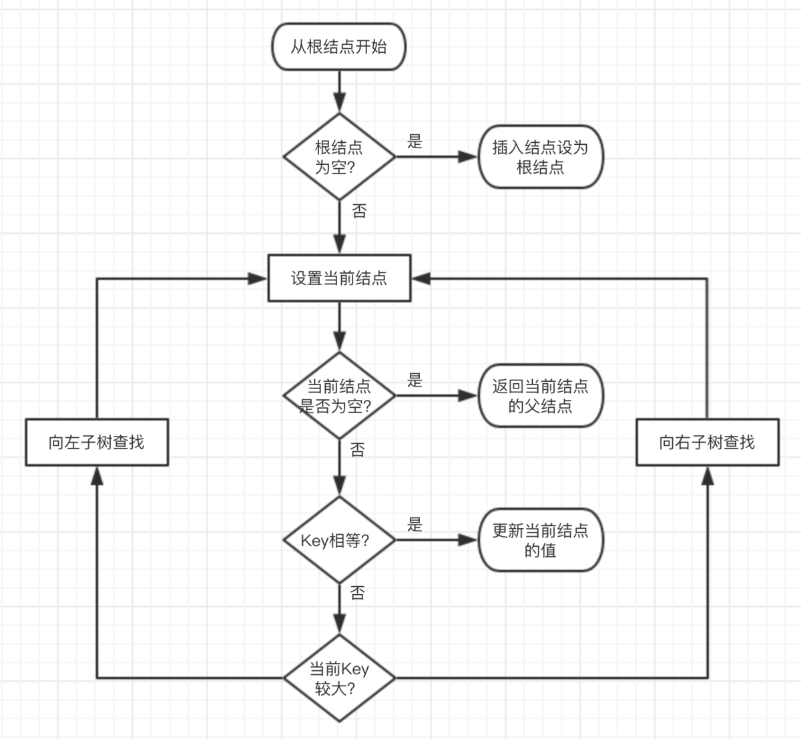
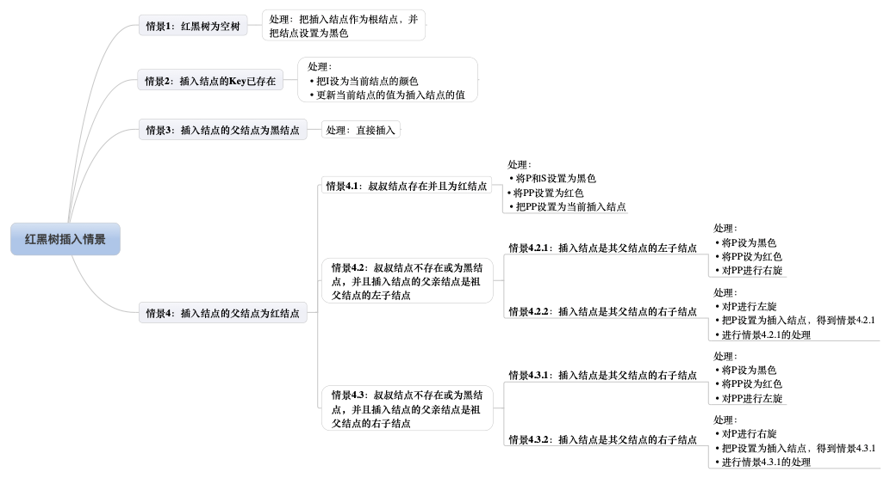

# 红黑树
### 1. 概念
红黑树是一个自平衡的二叉查找树，树上的每个节点都遵循如下规则：  

- 每个节点要么是红色，要么是黑色
- 根节点是黑色的
- 每个叶子节点（null）都是黑色的
- 每个红色节点的两个子节点一定都是黑色的
- 任意节点到每个叶子节点的路径都包含数量相同的子节点
- 一个节点有一个黑子节点，那么该节点一定有两个子节点
### 2. 操作
- 左旋：以某个节点作为支点(旋转节点)，其右子节点变为旋转节点的父节点，右子节点的左子节点变为旋转节点的右子节点，左子节点保持不变。  

- 右旋：以某个节点作为支点(旋转节点)，其左子节点变为旋转节点的父节点，左子节点的右子节点变为旋转节点的左子节点，右子节点保持不变。  

- 变色：节点的颜色由红变黑或由黑变红。
### 3. 查找流程

### 4. 插入流程

### 5. 插入情景

- 红黑树为空树
    - 将插入节点作为根节点，并保持根节点为黑色
- 插入节点的key已存在
    - 把插入节点设置为当前节点的颜色
    - 更新当前节点的颜色为插入节点的值
- 插入节点的父节点为黑色
    - 直接插入
- 插入节点的父节点为红节点
- 