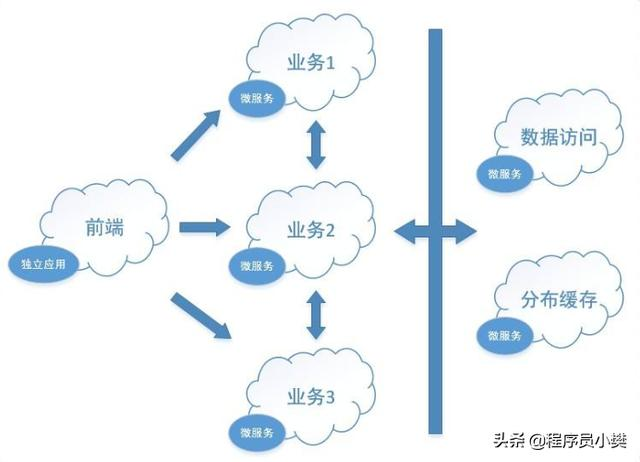
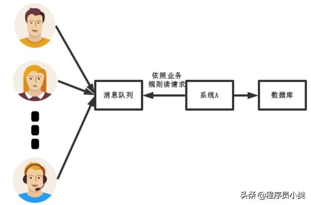

# 高并发解决方案
### 1. 系统拆分
将一个系统进行功能拆分，如现在流行的微服务，每个服务连接的数据库分开，分开部署。这样可以将压力进行拆分，缓解因为网络和数据库导致的高并发。  

### 2. 缓存
大部分场景下，都是查询多余插入更新，也就是读多写少。因此设计时对常用的查询内容必须进行缓存，查询时先查缓存，再查数据库；更新时也要更新缓存；  
redis 单机支持几万的并发。项目设计时针对那些承载主要请求的读场景，怎么用缓存来抗高并发。  

### 3. MQ
再考虑高并发写的场景，比如一个业务操作要数据库操作几十次，增删改增删改，在普通环境下不会有问题，但是如果高并发绝对会出现问题；  
如通讯分析项目，话单导入时多线程同时导入。如果多个用户都同时导入，会有多个导入任务，几十几百甚至启动上千的线程跑。也会导致系统出现问题；  
可以将大量的写请求灌入 MQ 里，进行排队，后边系统慢慢写，控制在数据库承载范围之内。MQ 单机支持几万并发，所以设计系统时，对应承载复杂写业务逻辑的场景里，如何用 MQ 来异步写，提升并发性。  
缺点：  
- 系统可用性降低-外部依赖越多，越容易出现问题
- 系统复杂度提高-需要处理重复消费和丢失的问题
- 一致性问题-由于是异步需要保证数据的完整  

### 4. 分库分表
单个数据库无法支持，可以考虑多个数据库；如果单个表内容太多可以考虑把表分开存储；单表数据量太大也可以表拆分或者类似分区表的形式处理，每个表的数据量保持少一点，提高 sql 跑的性能。  

### 5. 读写分离
读写分离，就是大部分时候数据库可能是读多写少，没必要所有请求都集中在一个库上，可以搞个主从架构，主库写入，从库读取，读写分离。读流量太多的时候，还可以加更多的从库。  

### 6. 搜索
如Elasticsearch，简称 es。es 是分布式的，可以随便扩容，分布式天然就可以支撑高并发，因为可以扩容加机器来扛更高的并发。一些比较简单的查询、统计类的操作，可以考虑用 es 来承载，还有一些全文搜索类的操作，也可以用 es 来承载。  
