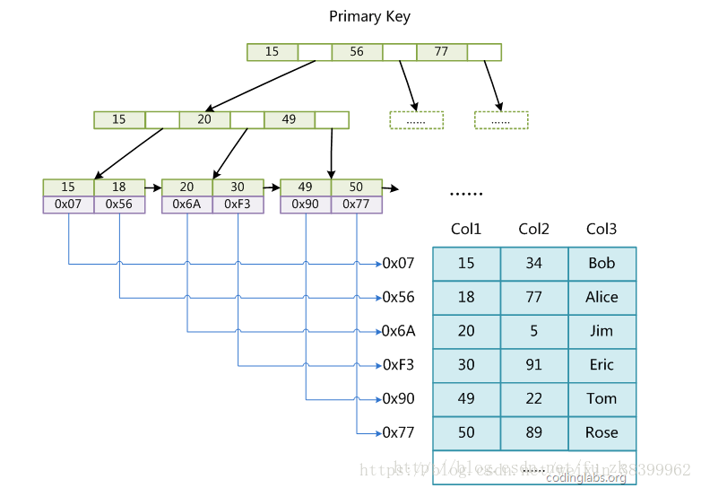
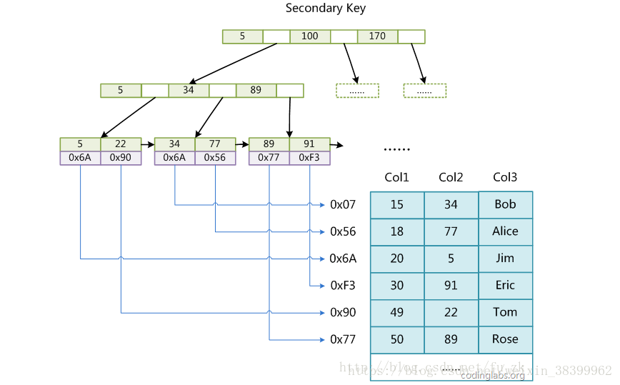
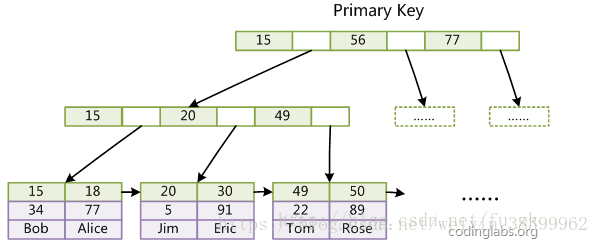
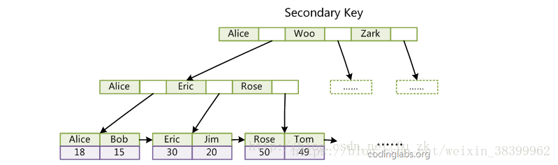

# MyISAM与InnoDB两种MySQL数据库引擎的比较
### 1. MyISAM索引实现
- 采用B+树作为索引结构，叶子结点存放的是数据记录的地址，主索引和辅助索引在实现上是没有去别的，仅仅只是定义上，主索引需唯一。  
  
  上图，采用col1作为主索引，下图使用col2作为辅助索引  
    
- MyISAM为非聚集性索引，故存在无主键的表
### 2. InnoDB索引实现
- 采用B+树来构造，其数据文件本身就是索引文件，叶子节点含索引和数据  
  
上图为主索引，下图为辅助索引，其会引入主键作为数据域。  
  
- InnoDB为聚集性索引
### 3. 聚集性索引 & 非聚集性索引
- 聚集性索引：一张表只能有一个聚簇索引，叶子节点包含完整数据记录
- 非聚集性索引：一张表能有多个非聚集性索引，叶子节点含主键信息，而非完整的数据
- 聚集性索引最大限度地提高了I/O密集型应用的性能
- 聚集性索引限制有如下几个：
    - 插入速度严重依赖于插入顺序，按照主键的顺序插入是最快的方式，否则将会出现页分裂，严重影响性能。因此，对于InnoDB表，我们一般都会定义一个自增的ID列为主键。
    - 更新主键的代价很高，因为将会导致被更新的行移动。因此，对于InnoDB表，我们一般定义主键为不可更新。
    - 二级索引访问需要两次索引查找，第一次找到主键值，第二次根据主键值找到行数据。