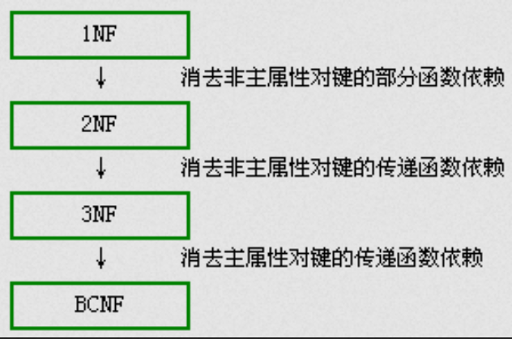
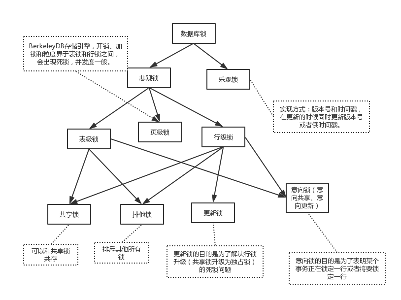
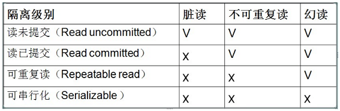

# 数据库基本原理
### 1. 事务
- 定义：它是一个操作序列，这些操作要么都执行，要么都不执行，它是一个不可分割的工作单位。
- 特性：
    - 原子性（A）：事务是一个不可分割的工作单位，事务中的操作要么都发生，要么都不发生。
    - 一致性（C）：事务开始之前和事务结束以后，数据库的完整性约束没有被破坏。
    - 隔离性（I）：多个事务并发访问时，事务之间是隔离的，一个事务不应该影响其它事务运行效果。
    - 持久性（D）：事务完成以后，该事务所对数据库所作的更改便持久的保存在数据库之中，并不会被回滚。
### 2. 三级模式
- 概念模式（模式）：数据库中全部数据的整体逻辑结构的描述。它由若干概念记录类型组成，还包含记录间的联系、数据的完整性和安全性等要求。
- 外模式（子模式）：用户与数据库系统的接口，是用户用到的那部分数据的描述。外模式由若干个记录类型组成。
- 内模式（物理模式）：数据库在物理存储上的描述，它定义了所有的内部记录类型、索引和文件的组织方式，以及数据控制方面的细节。
### 3. 范式
- 第一范式：实体中的某个属性不能有多个值或者不能有重复的属性
- 第二范式：属性完全依赖于主键 [ 消除部分子函数依赖 ]
- 第三范式：第三范式（3NF）属性不依赖于其它非主属性 [ 消除传递依赖 ]
- BCNF范式：第三范式的基础上，数据库表中不存在任何字段对任一候选关键字段的传递函数依赖  

### 4. 锁
  
- 分类：
    - 乐观锁一般是指用户自己实现的一种锁机制，假设认为数据一般情况下不会造成冲突，所以在数据进行提交更新的时候，才会正式对数据的冲突与否进行检测，如果发现冲突了，则让返回用户错误的信息，让用户决定如何去做。乐观锁的实现方式一般包括使用版本号和时间戳。
    - 悲观锁一般就是我们通常说的数据库锁机制。悲观锁主要表锁、行锁、页锁。在MyISAM中只用到表锁，不会有死锁的问题，锁的开销也很小，但是相应的并发能力很差。innodb实现了行级锁和表锁，锁的粒度变小了，并发能力变强，但是相应的锁的开销变大，很有可能出现死锁。同时inodb需要协调这两种锁，算法也变得复杂。InnoDB行锁是通过给索引上的索引项加锁来实现的，只有通过索引条件检索数据，InnoDB才使用行级锁，否则，InnoDB将使用表锁。
    - 表锁和行锁都分为共享锁和排他锁（独占锁），而更新锁是为了解决行锁升级（共享锁升级为独占锁）的死锁问题。
    - 在意向锁存在的情况下，事务A必须先申请表的意向共享锁，成功后再申请一行的行锁，解决了需要要遍历行判断
- 行锁分类：
    - 共享锁
        - 加锁与解锁：当一个事务执行select语句时，数据库系统会为这个事务分配一把共享锁，来锁定被查询的数据。在默认情况下，数据被读取后，数据库系统立即解除共享锁。例如，当一个事务执行查询“SELECT * FROM accounts”语句时，数据库系统首先锁定第一行，读取之后，解除对第一行的锁定，然后锁定第二行。这样，在一个事务读操作过程中，允许其他事务同时更新accounts表中未锁定的行。
        - 兼容性：如果数据资源上放置了共享锁，还能再放置共享锁和更新锁。
        - 并发性能：具有良好的并发性能，当数据被放置共享锁后，还可以再放置共享锁或更新锁。所以并发性能很好。
    - 排他锁
        - 加锁与解锁：当一个事务执行insert、update或delete语句时，数据库系统会自动对SQL语句操纵的数据资源使用独占锁。如果该数据资源已经有其他锁（任何锁）存在时，就无法对其再放置独占锁了。
        - 兼容性：独占锁不能和其他锁兼容，如果数据资源上已经加了独占锁，就不能再放置其他的锁了。同样，如果数据资源上已经放置了其他锁，那么也就不能再放置独占锁了。
        - 并发性能：最差。只允许一个事务访问锁定的数据，如果其他事务也需要访问该数据，就必须等待。
    - 更新锁：更新锁在的初始化阶段用来锁定可能要被修改的资源，这可以避免使用共享锁造成的死锁现象。两个事务都获取了同一数据资源的共享锁，然后都要把锁升级为独占锁，但需要等待另一个事务解除共享锁才能升级为独占锁，这就造成了死锁。
        - 加锁与解锁：当一个事务执行update语句时，数据库系统会先为事务分配一把更新锁。当读取数据完毕，执行更新操作时，会把更新锁升级为独占锁。
        - 兼容性：更新锁与共享锁是兼容的，也就是说，一个资源可以同时放置更新锁和共享锁，但是最多放置一把更新锁。这样，当多个事务更新相同的数据时，只有一个事务能获得更新锁，然后再把更新锁升级为独占锁，其他事务必须等到前一个事务结束后，才能获取得更新锁，这就避免了死锁。
        - 并发性能：允许多个事务同时读锁定的资源，但不允许其他事务修改它。
### 5. 隔离级别
- 读未提交，存在脏读：一个事务中的读操作可能读到另一个事务中未提交修改的数据，如果事务发生回滚就可能造成错误。
- 读已提交，存在不可重复读：一个读的事务过程中，如果读取数据两次，在两次之间有写事务修改了数据，将会导致两次读取的结果不一致，从而导致逻辑错误。
- 可重复读，会出现幻读：一个事务中如果有多次读取操作，读取结果需要一致（指的是固定一条数据的一致，幻读指的是查询出的数量不一致）。
- 可串行化：最高的隔离级别，它通过强制事务排序，使之不可能相互冲突，从而解决幻读问题。

### 6. 完整性约束
- 实体完整性：通过主键（primary key）约束和候选键（candidate key）约束来实现的。
- 参照完整性：在 CREATE TABLE 或 ALTER TABLE 语句中使用 FOREIGN KEY 和 REFERENCES 来实现
- 用户定义完整性：触发器、CHECK、UNIQUE等实现的