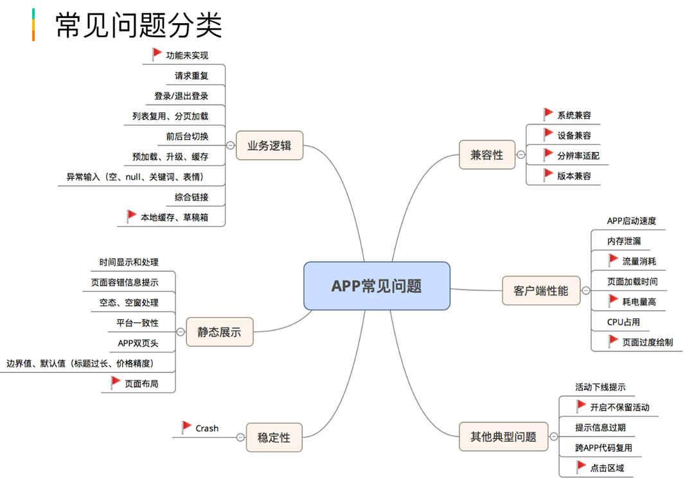
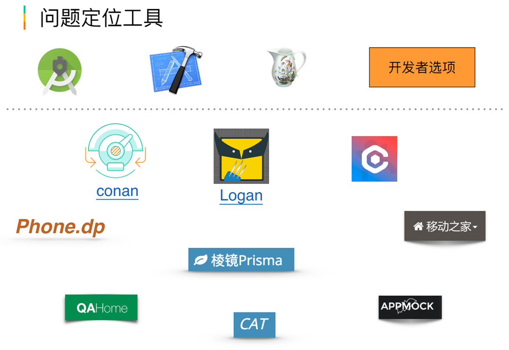
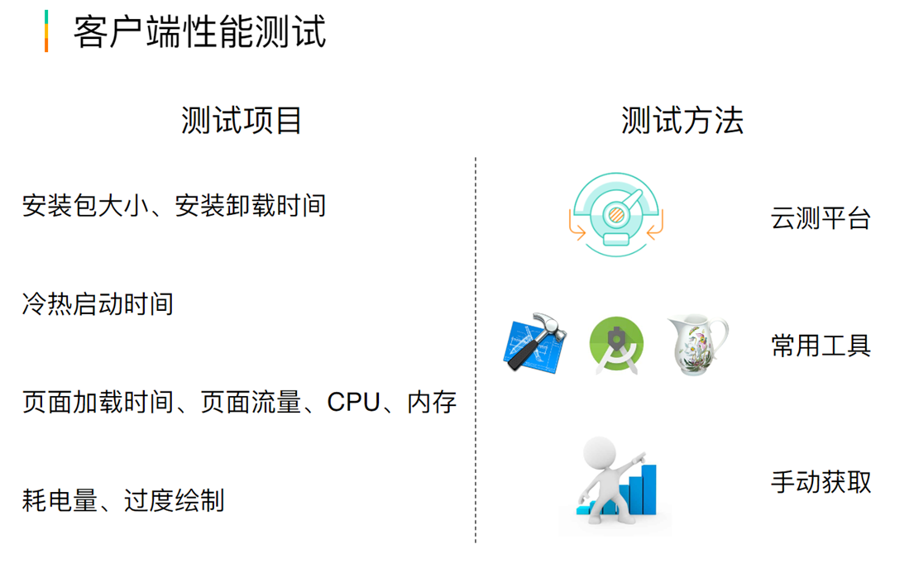
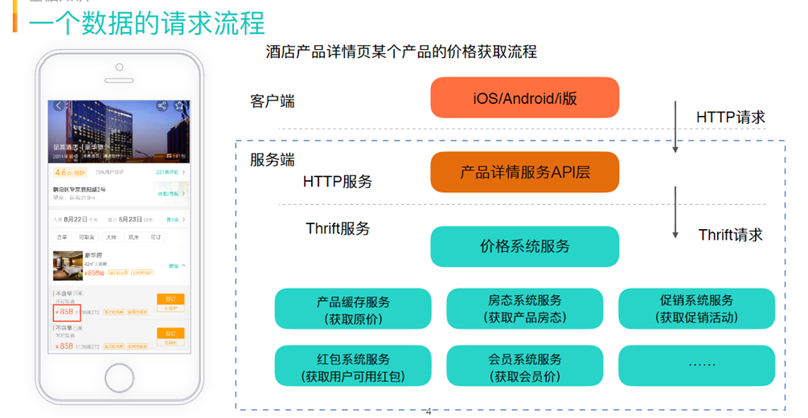

# 自学视频
1. 测试环境  
- test：线下服务+线下数据
- stage：线下服务+线上数据
- prod：线上服务+线上数据
2. 性能测试  
- 性能指标
    - 响应时延：
        - 种类：
            - 冷启动（完全退出）
            - 热启动（后台，重新启动）
            - 首次启动
            - 页面加载
        - 方法：
            - 录屏掐表
            - 控件识别
            - 性能埋点
    - 流畅度
        - 页面：
            - 低于24FPS：感知不连续
            - 低于30FPS：无法表达绚丽画面
            - 平台要求大于50FPS
        - 方法：
            - adb shell dumpsys gfinfo
            - 腾讯GT
            - 性能埋点
    - 耗电量
    - 包大小
    - 内存
    - cpu
    - 磁盘I/O
    - 网络I/O
- 兼容性测试
    - 核心梳理
    - 交叉覆盖
    - 监控运营
3. 客户端问题诊断引导  
- 了解问题
    - 谁->什么设备->什么App版本->什么功能->什么场景->什么问题
- 客户端问题类型
    - 逻辑/UI问题
        - 业务逻辑：请求重复、预加载、分页、前后台切换等
        - UI展示及交互：UI展示截断、兜底值、边界值、默认值
        - 兼容性：系统兼容性、分辨率、特定设备类型
    - 异常
        - crash：闪退
        - ANR：应用程序无响应
        - 卡顿：主线程无响应5s
        - MRN：js异常，开发模式红色背景，展示代码错误信息；生产环境会导致整个app白屏，点击无响应等
    - 性能问题
        - CPU
        - 内存
        - 耗电量
        - 流畅度
        - 流量
        - 弱网
        - 安全等。
- 问题诊断流程
    - 信息获取
        - 问题来源、阶段
        - 获取完成反馈信息
        - 尝试复现
    - 原因分析
        - 初步类型、原因判断
        - 提取关键线索
        - 获取数据、验证判断
        - 根据问题类型及原因判断影响及紧迫度，判断是否引入第三方共同排查
    - 修复验证
        - 按评定结果修复问题
    - 总结防范
        - 原因分析复盘
        - 主动监控预防
- app常见问题  

- 问题定位工具  
X
- 性能测试  
  
明确测试需求，设计测试场景->手动获取数据，自动化获取数据->制定测试标准，分析数据，定位问题->优化  
- 服务器端——数据请求流程  

- 测试内容
    - 功能测试
        - 正常场景
        - 边界场景
        - 异常场景
    - 兼容性测试
        - 终端兼容性
        - 版本兼容性
        - 数据兼容性
    - 性能测试
        - 响应时间
        - 吞吐量
        - 并发数
        - 资源使用
    - 安全测试
        - 敏感信息加密
        - SQL注入
        - XXS攻击
        - 抓取与反爬
- 测试验证点
    - 请求及响应
        - 请求方式，Header，请求参数及类型
        - 返回状态码、返回值及字段类型等
    - 数据及状态
        - 数据库
        - 缓存
        - 消息队列等
    - 日志及监控
        - 日志
        - 业务监控
        - 系统监控等
- 接口测试：
    - 定义：针对各服务之间的一种测试，属于功能测试，主要检查数据的交换，传递和控制管理过程，以及服务之间的相互逻辑依赖关系
    - 手段：
        - 工具：Postman、Curl命令，Jmeter等
        - 编程语言：Java、Python等
- Mock测试：
    - 定义：在测试过程中，对于某些不容易构造或者不容易获取的数据，用一个虚拟的对象来提供相应的数据以便测试
    - 使用范围：
        - Thrift接口：工具Moka2、Moka3
        - HTTP接口：工具Lyrebird、Moka3
        - 特点：控制返回，覆盖难以构造的场景
- Diff测试
    - 概念：同样请求参数，不同环境即不同代码，大量的对比测试
    - 使用范围：读接口
    - 使用场景：接口返回值基本一致
    - 优势：效率高
    - 特点
        - 作为接口测试的补充手段
        - 覆盖场景不可控
        - 依赖环境要求必须一致
    - 工具：（HTTP+Mapi+Thrift+Pigeon）Diff测试工具、回归测试平台
- 接口自动化测试
    - 意义：减少重复手工测试，提升效率；维护成本低，收益高；快速实现持续集成
    - 接口自动化测试框架：
        - 基于JMeter
        - 基于Python+Requests+Unittest
        - 基于Java+TestNG
    - 基本原则：简洁、清晰
        - 不强依赖环境和数据，可在任意环境执行，数据自产自销
        - 测试用例必须有校验，不要写永远不会挂的case
        - 写正确的case，而不是容易通过的case
        - 代码规范，结构清晰且有详细的注释
        - 代码简洁易懂，没有复杂逻辑
        - 配置、数据等需要版本管理
        - keep Running