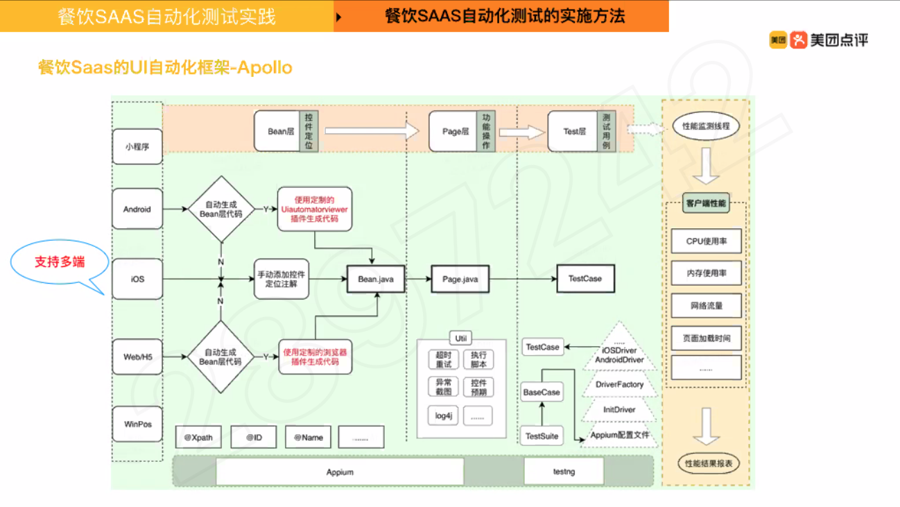

# 质量专项培训第三天
### 1. 概念与入门
- - -
- 软件测试定义：规定条件下，对程序进行操作，以发现程序的错误，衡量软件质量。并对其能否满足设计要求进行评估的过程
- 自动化测试定义：一切通过工具的方式来代替或辅助手工测试的行为/通过工具记录或编写脚本模拟人工测试
- 自动化原因
    - 保证质量：人会犯错，程序不会
    - 提高效率：人会累，机器不会/自动化case编写一次，可以重复执行
- 适合项目
    - 需求稳定
    - 项目周期长
    - 用例/脚本可重复使用
- - -
### 2. 自动化测试基础
- - -
- 三要素
    - 输入条件：基于测试类型、测试目的和业务逻辑，构造的一组测试数据或者操作
    - 测试逻辑：主要从功能，业务逻辑，产品/开发文档等方面入手
    - 结果断言：比对返回的结果是否和预期一致，一般通过assert等关键字来完成
- 用例编写
    - case名称简洁明了
    - 数据构造需要考虑各种场景
    - 结果一定要有断言
- 持续集成
    - 定义：频繁地将代码集成到主干的一种软件开发实践
    - 目的：
        - 防止分支大幅偏离主干。如果不是经常集成，主干又在不断更新，会导致以后集成的难度变大，甚至难以集成
        - 快速发现错误，降低风险。每完成一点更新，就集成到主干，可以快速发现错误，定位错误也比较容易
- 任务调度：build->unit tests->deploy->api/ui tests
- - -
### 3. 餐饮SAAS实践
- - -
- 实施方式：
    - 单元测试
        - RD实施
        - 要求代码行覆盖率>70%
    - ui自动化测试
        - QA实施
        - 覆盖业务主流程场景
        - 主要用于回归测试
    - 接口自动化测试
        - QA实施
        - 核心接口全覆盖
        - 接口类型包含：http + thrift接口
        - 运行方式：
            - 本地调试
            - CI运行
            - Devops接入
- http接口
    - 请求：
        - 请求头：键值对
        - 请求行：url(协议名://ip/域名/资源路径)、协议版本、请求方法（post/get/put/delete...）
        - 请求体（正文）
    - 响应
        - 响应头：键值对
        - 响应行：协议版本、响应状态码、响应状态码描述
        - 响应体（正文）
- Thrift：跨语言的RPC框架
    - 引入Thrift库依赖
    - 编写Thrift接口定义文件
    - 根据IDL文件生成源文件
    - 实现服务接口
    - 实现Thrift Server
    - 实现Thrift Client
    - 编写和调试用例
- ui自动化测试
    - 定义：基于页面元素的识别和定位来进行模拟用户行为的测试，位于测试金字塔模型的顶层
    - 主要应用场景
        - 重复性的功能验证及回归测试，节省人力投入
        - 避免疲惫操作时的认为测试遗漏，保障主流程和核心功能的可用性
        - 通过UI自动化操作获取其他测试数据
- Apollo框架  
    
- 保证UI自动化Case的稳定性
    - 不同case不要设置依赖关系
    - 同一个测试类里面，不同的测试方法，统一起点和终点
    - 在@afterMethod里面做好“善后”和“预处理”工作，以支持框架的“失败重试”机制
- - -