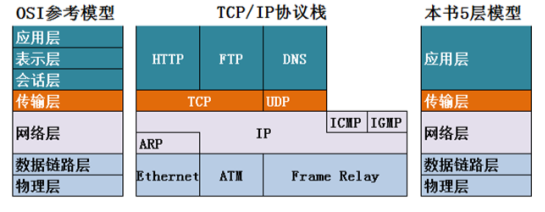
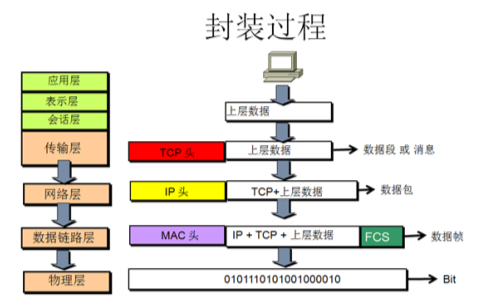

# 计算机网络基础知识
### 1. OSI、TCP/IP、五层协议体系结构，以及各层协议
  
  
- 物理层：通过媒介传输比特,确定机械及电气规范（比特Bit）（中继器、集线器、网关）
- 链路层：将比特组装成帧和点到点的传递（帧Frame）（MAC协议）（交换机）
- 网络层：负责数据包从源到宿的传递和网际互连（包Packet）（IP、ICMP、ARP、RARP、OSPF、IPX、RIP、IGRP协议）（路由器）
- 传输层：提供端到端的可靠报文传递和错误恢复（段Segment）（TCP、UDP）
- 会话层：建立、管理和终止会话（会话协议数据单元SPDU）
- 表示层：对数据进行翻译、加密和压缩（表示协议数据单元PPDU）
- 应用层：允许访问OSI环境的手段（应用协议数据单元APDU）（FTP、DNS、Telnet、SMTP、HTTP、WWW、NFS）
### 2. IP地址分类
- 每个IP地址又可分为两部分。即网络号部分和主机号部分：网络号表示其所属的网络段编号，主机号则表示该网段中该主机的地址编号。按照网络规模的大小，IP地址可以分为A、B、C、D、E五类  
    - A类地址：以0开头，      第一个字节范围：0~127（1.0.0.0 - 126.255.255.255）；
    - B类地址：以10开头，    第一个字节范围：128~191（128.0.0.0 - 191.255.255.255）；
    - C类地址：以110开头，  第一个字节范围：192~223（192.0.0.0 - 223.255.255.255）；
- IP地址与子网掩码相与得到网络号
- 主机号，全为0的是网络号（例如：192.168.2.0），主机号全为1的为广播地址（192.168.2.255）
### 3. ARP地址解析协议
地址解析协议，即ARP（Address Resolution Protocol），是根据IP地址获取物理地址的一个TCP/IP协议。
- 首先，每个主机都会在自己的ARP缓冲区中建立一个ARP列表，以表示IP地址和MAC地址之间的对应关系。
- 当源主机要发送数据时，首先检查ARP列表中是否有对应IP地址的目的主机的MAC地址，如果有，则直接发送数据，如果没有，就向本网段的所有主机发送ARP数据包，该数据包包括的内容有：源主机 IP地址，源主机MAC地址，目的主机的IP 地址
- 当本网络的所有主机收到该ARP数据包时，首先检查数据包中的IP地址是否是自己的IP地址，如果不是，则忽略该数据包，如果是，则首先从数据包中取出源主机的IP和MAC地址写入到ARP列表中，如果已经存在，则覆盖，然后将自己的MAC地址写入ARP响应包中，告诉源主机自己是它想要找的MAC地址。
- 源主机收到ARP响应包后。将目的主机的IP和MAC地址写入ARP列表，并利用此信息发送数据。如果源主机一直没有收到ARP响应数据包，表示ARP查询失败。  
注意：广播（255.255.255.255）发送ARP请求，单播发送ARP响应。
### 4. 简单介绍几种协议
- ICMP协议： 因特网控制报文协议。它是TCP/IP协议族的一个子协议，用于在IP主机、路由器之间传递控制消息
- HTTP协议： 超文本传输协议，是一个属于应用层的面向对象的协议，由于其简捷、快速的方式，适用于分布式超媒体信息系统
- NAT协议：网络地址转换属接入广域网(WAN)技术，是一种将私有（保留）地址转化为合法IP地址的转换技术
- DHCP协议：动态主机配置协议，是一种让系统得以连接到网络上，并获取所需要的配置参数手段，使用UDP协议工作。具体用途：给内部网络或网络服务供应商自动分配IP地址，给用户或者内部网络管理员作为对所有计算机作中央管理的手段。
### 5. TCP与UDP区别
- TCP
    - 有连接
    - 可靠的
    - 面向字节流
    - 全双工通信，TCP两端既可以作为发送端也可以作为接收端
    - 连接的两端只能是两个端点，即一对一，不能一对多
    - 至少20个字节，比UDP大的多
- UDP
    - 无连接
    - 不可靠（不能保证都送达）
    - 面向报文（UDP数据传输单位是报文，不会对数据进行拆分和拼接操作，只是给上层传来的数据加个UDP头或者给下层来的数据去掉UDP头）
    - 没有拥塞控制，始终以恒定速率发送数据
    - 支持一对一、一对多、多对多、多对一
    - 首部开销小，只有8字节
### 6. TCP与UDP分别对应的协议
- TCP
    - FTP：定义了文件传输协议，使用21端口。
    - Telnet：一种用于远程登陆的端口，使用23端口，用户可以以自己的身份远程连接到计算机上，可提供基于DOS模式下的通信服务。
    - SMTP：邮件传送协议，用于发送邮件。服务器开放的是25号端口。
    - POP3：它是和SMTP对应，POP3用于接收邮件。POP3协议所用的是110端口。
    - HTTP：是从Web服务器传输超文本到本地浏览器的传送协议。
- UDP
    - DNS：用于域名解析服务，将域名地址转换为IP地址。DNS用的是53号端口。
    - TFTP(Trival File Transfer Protocal)，简单文件传输协议，该协议在熟知端口69上使用UDP服务。