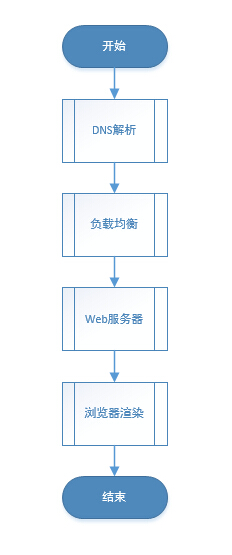
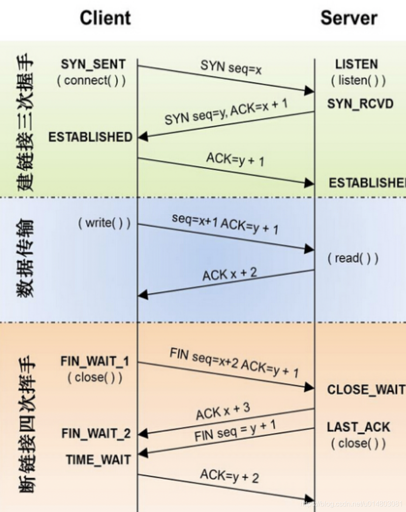
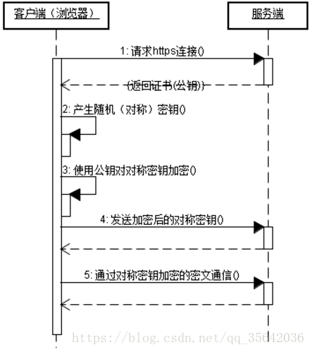
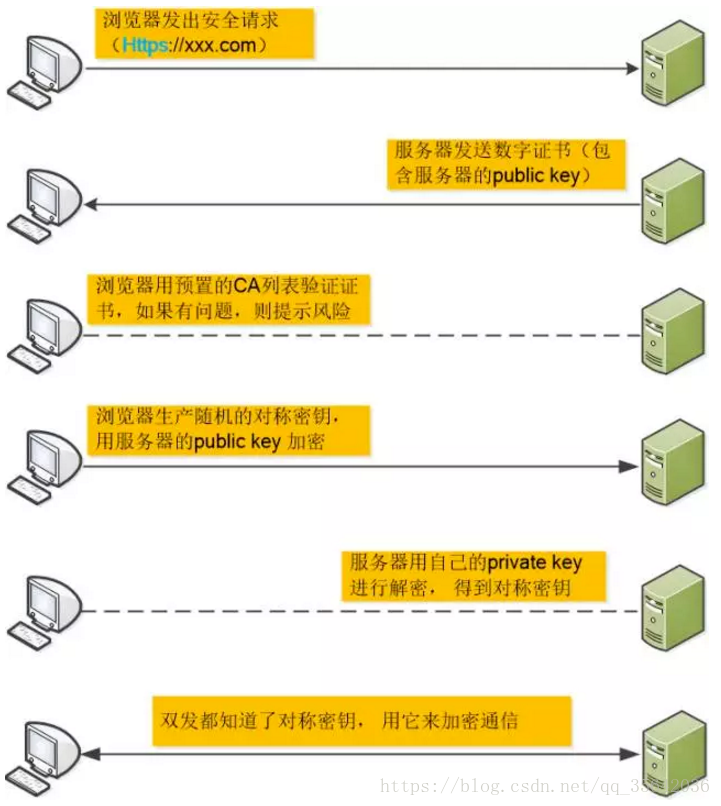

# 访问网站全过程
### 1. 整体流程图

### 2. 具体步骤
- DNS解析
    - 递归和迭代两种方式，解析域名
    - 浏览器自身缓存->本地hosts文件->向域名服务器请求解析
- TCP请求
  
    - 三次握手：如果服务器确认，就建立连接，而第三次握手的时候，因为网络滞留或丢失，会造成资源的占用，滞留时间太长，连接失效，会误以为该次是要建立新的连接，会导致意想不到的错误。
    - 四次挥手：tcp是面向连接的（全双工），前两次挥手，是客户端告诉服务器我的数据发完了，服务器知道你的数据发完了；后两次挥手是服务器告诉客户端，我的数据也发完了，客户端知道收到了。
- 发送http或者https请求
    - http
        - 无状态：协议对客户端没有状态存储，对事物处理没有“记忆”能力，比如访问一个网站需要反复进行登录操作。
        - 无连接：HTTP/1.1之前，由于无状态特点，每次请求需要通过TCP三次握手四次挥手，和服务器重新建立连接。
        - 基于请求和响应：基本的特性，由客户端发起请求，服务端响应。
        - 简单快速、灵活。
        - 通信使用明文、请求和响应不会对通信方进行确认、无法保护数据的完整性。
    - https
        - 内容加密：采用混合加密技术，中间者无法直接查看明文内容
        - 验证身份：通过证书认证客户端访问的是自己的服务器
        - 保护数据完整性：防止传输的内容被中间人冒充或者篡改
    - http vs https
        - HTTPS 协议需要到数字证书认证机构(CA, Certificate Authority )申请证书，一般免费证书很少，需要交费
        - HTTP 是超文本传输协议，信息是明文传输，HTTPS 则是具有安全性的 ssl 加密传输协议
        - HTTP 和 HTTPS 使用完全不同的连接方式，用的端口也不一样，前者是 80，后者是 443
        - HTTP 的连接很简单，是无状态的；HTTPS 协议是由 ssl+HTTP 协议构建的可进行加密传输、身份认证的网络协议，比 HTTP 协议安全
        - HTTPS 比较耗性能  
  
  
- 负载均衡：一台服务器无法支持大量用户的访问，将用户分摊到两个或者多个服务器上的方法
- 浏览器渲染
    - 浏览器根据页面内容，生成DOM Tree。根据CSS内容，生成CSS Rule Tree(规则树)。调用JS执行引擎执行JS代码。
    - 根据DOM Tree和CSS Rule Tree生成Render Tree(呈现树)。
    - 根据Render Tree渲染网页。
- 静态资源加载：CDN叫内容分发网络，是依靠部署在各地的边缘服务器，使用户就近获取所需内容，降低网络拥塞，提高用户访问响应速度。